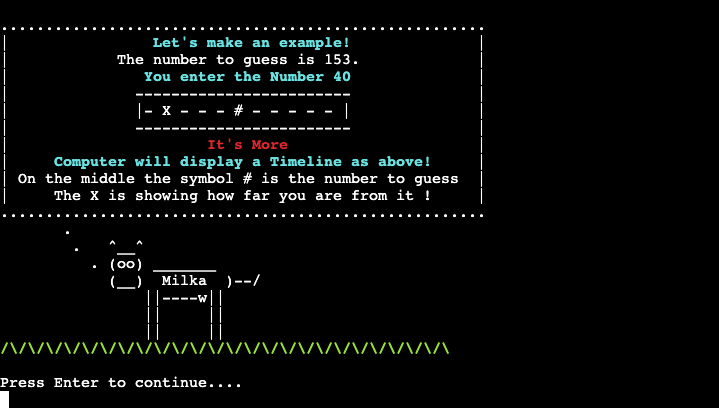

# Purpose of this project

This project was developed in order to demonstrate 
some ability to code in Python.

# Le Juste Prix

This game was very famous in 90' in France. I got inspired by doing a game as the original version of
"Le Juste Prix"

If you are interested just check this link [here](https://www.youtube.com/watch?v=km34cI20HHw)

Sometimes is better a good picture than a big text to explain something : 

Some basics informations around this game :
- The user plays against the computer.
- The player select a level of difficulty which will give to computer a specific range where to select a number
- Time is starting to run when computer inform the player that a number has been selected
- The player can guess the computer's number as many time as he wants but time is running
- The aim is to guess the computer's number as fast as possible!
- When the player enter the computer 's selected number, the Time stops and computer calculates Time on-game
- Time is calculated in second and Time on-game will determinate the position of the player into the score tab
- A message is displayed to show up the player his position in the score tab

# Contents

* [**User Experience UX**](<#user-experience-ux>)
    * [Wireframes](<#wireframes>)
    * [Structure of the game](<#structure-of-the-game>)
    * [Programming Structure](<#programming-structure>)
    * [Design Choices](<#design-choices>)
    *   [Typography](<#typography>)
    *   [User stories](<#user-stories>)
* [**Features**](<#features>)
    * [**Loading a New Game**](<#loading-a-new-game>)
    * [**When is the Game finished**](<#when-is-the-game-finished>)
    * [**Errors**](<#errors>)
    * [**Future Features**](<#future-features>)
* [**Technologies Used**](<#technologies-used>)
* [**Testing**](<#testing>)
     * [**Am i responsive?**](<#am-i-responsive>)
     * [**Python Validator**](<#python>)
     * [**Browser Compatibility**](<#browser-compatibility>)
     * [**Bugs**](<bugs>)
* [**Deployment**](<#deployment>)
* [**Credits**](<#credits>)
    * [**Content**](<#content>)
    * [**Media**](<#media>)
    * [**Best part of this project**](<#best-part-of-this-project>)
*  [**Acknowledgements**](<#acknowledgements>)

# User Experience (UX)

## Wireframes

The wireframes for this game were inspired by  [CowSay](https://en.wikipedia.org/wiki/Cowsay).

If you are curious and want to try it on your own Unix Machine  Run `apt-get install cowsay` on a terminal as following :
(This action is not required, it's just for fun)

From beginning, i wanted to make the game interactive with a custom print function:

This is the final interaction layout of the Game:

[Back to top](<#contents>)

## Structure of the game

Le juste prix game has ONE main page run.py . The [Game](https://lejusteprix.herokuapp.com/) is the default loading page. When first loading, a box pops up displaying a welcome message . Next box, the user will be invited to register an username.

This name will be registered to Excel file database for scoring tab display (We will see this in details later on in
this readme file)

A Main menu has been created to give easy access to differents sections :
- Playing the Game
- See the instructions of the Game
- See the top5 players score of each Level of difficulty

Press Enter to run the instructions....

After finishing to read the instructions, the user can start playing!

 The Game have 4 differents level of difficulty:
* Beginner : User will have to guess a number from 1 to 100
* Medium : User will have to guess a number from 1 to 500
* hard : User will have to guess a number from 1 to 1000
* Champion : User will have to guess a number from 1 to 10000

[Back to top](<#contents>)

## Programming Structure

Before starting to code, I wanted to have a big picture of the programming structure :

 ** Beginning of the Game ** :
   - 1/Get instructions of the game 
   - 2/choose the level of the game 
   - 3/Time is starting to get registered 
   - 4/Run the Game 
   - 5/user found the good number, we stop the Time 
   - 6/Calculate the time on-game 
   - 7/According the selected level, we select a right worksheet 
   - 8/We register the data into excel file 
   - 9/We sort the files by Time value, smaller time is first 
   - 10/We show the scoring tab 

[Back to top](<#contents>)

## Design Choices

 * ### Typography
      The game beeing only running with a terminal design, i wanted to create a custom print function 
      to make it more friendly. In fact, no graphical effects here so the main focus was on creating
      a friendly design to catch the interest from the user...

      

[Back to top](<#contents>)

* ### User stories

First Time Visitor Goals

- As a First Time Visitor, I want immediately to understand the main purpose of the game.
- I want to be able to quickly understand the game controls and mechanics in order to enjoy playing the game
- I want to be able to consult the game instructions as many time I want.
- I want to be able to see my score after each game.
- I would like to play a simple game, with a fairly short play time.

Considering that there is no possibility to login for the user, the Game is built in the way that :
  - As long as you perform at least one game, your name and scoring is registered into database
  - if your name is already on the database, your score for each game will be updated (only if user perform a new personal record of course!)
  - The user can come back to this game any time in the future and challenge himself if he used the same username as registered previously

# Features 

The game should have a fun design and is intended for users as an entertainment value only.

[Back to top](<#contents>)

* ## Loading a New Game

  ### How do we start a new Game?
There is nothing to do, just start the game and give your username.

After the Result of the game has been revealed, a new game is loading only if user wants it :

[Back to top](<#contents>)

* ## When is the game finished

  ### How do we stop the Game ?

It's a no ending Game, one new Game will be generated after revealing the result of current game.
The score will be registered into the excel file and a new game is loading.
So if you want to stop playing do the following :

- Press `"q"` when prompt the following message :

- Then close the brownser window

- To get back to the game

[Click here](https://lejusteprix.herokuapp.com/)

Easy, right? :-D

[Back to top](<#contents>)

* ## Errors

  ### A message is displayed
Each time you type an wrong answer, the Game will guide you to get back on track :

[Back to top](<#contents>)

  ### Future Features

As a Future Features, it could be interesting for the user to choose himself the range of number to guess...

[Back to top](<#contents>)

# Technologies Used

* [Python](https://www.python.org/) - provides game's functions and rules.
* [Heroku](https://www.heroku.com/) - used to deploy the Game online.
* [Gitpod](https://www.gitpod.io/#get-started) - used to get a workspace to use for coding.
* [Github](https://github.com/) - used to edit the website.

[Back to top](<#contents>)

# Testing

## Am I responsive App?

- Responsive test from https://ui.dev/amiresponsive :

[Back to top](<#contents>)

## PYTHON VALIDATOR

### PYTHON

The Python validator results is below:
- run.py : for testing I used the following tools [here](https://pep8ci.herokuapp.com/) 

No errors detected.

[Back to top](<#contents>)

## Browser Compatibility

The website was tested on the following browsers with no visible issues for the user :
- Brave
- Mozilla Firefox
- Safari

Appearance, functionality and responsiveness were consistent throughout for the previous range of browsers.

[Back to top](<#contents>)

### To sum up
To sum up :

- I confirm that the main content of the game is readable and easy to understand.
- I confirm that the interaction with the user is smooth and efficient with errors management functions.

[Back to top](<#contents>) 

### Bugs

## Fixed Bug

As i said, I wanted to create an custom print function for this game. It tooks me sometimes 
to code it proprely because each message you want to display is different to an other.
Dealing with different type of messages create some problems in the display :

Detecting each type of messages to display, I found the way to have a perfect display :

[Back to top](<#contents>) 

## Unfixed Bug

When making some repetitive tests on my code, i got this following message :

It looks like the only way to fix this problem of quota is to register for a new package from Google Cloud Service.

[Back to top](<#contents>)

# Deployment

## How to fork a repository :

If you need to "FORK" a repository:

1. Login in to [GitHub](https://github.com/) and go to https://github.com/artontray/PROJECT3
2. In the top right corner, click `Fork`
3. The next page will be the forked version of https://github.com/artontray/PROJECT3 but in your own repository

[Back to top](<#contents>)

### How to create a local clone of this project :

The method from cloning a project from GitHub is below:

1. Under the repository’s name, click on the **code** tab.
2. In the **Clone with HTTPS** section, click on the clipboard icon to copy the given URL.

3. In your IDE of choice, open **Git Bash**.
4. Change the current working directory to the location where you want the cloned directory to be made.
5. Type **git clone**, and then paste the URL copied from GitHub.
6. Press **enter** and the local clone will be created.

[Back to top](<#contents>)

### To deploy the project with Heroku:

The site was deployed to Heroku cloud Platform. To be able to run your python program on the web,
 you need Heroku Cloud platform to host it and deploy. There are severals steps to proceed,
 please , follow carefully every steps :
  1. Create an account gmail
  2. Go to [Cloud](https://console.cloud.google.com/)
  3. Create a New Project

  
    
  
  
  4. Select your project

  

  5. Search for Library into APIs and Services Left Menu

  

[Back to top](<#contents>)

  6. Search for Google Drive API and ENABLE IT

  
  
  

  7. Do the same but searching for google Sheet and ENABLE IT

  

  8. Create CREDENTIALS

  
  
  
  

  9. Select a role

  
  

[Back to top](<#contents>)

  10. Editing Credentials

  
  
  
  

  11. Download your JSON FILE

  It will automatically download a JSON file, save it on your computer.

  

  11. Key will be active

  

[Back to top](<#contents>)

  12. Import the excel file

  Go to this [File](https://docs.google.com/spreadsheets/d/1qtw3ptZlbgvp-eiT1_8UuVNh6PpEY68l-ZJn4-vVrac/edit#gid=0)

  And Make a copy and share the file with the email created into cloud 

  
  
  
  

  Be sure to select EDITOR when sharing the file :

  

  13. Fork the project with Github and open it with Gitpod :

  To fork the project, refer to this part [**Deployment**](<#deployment>)

  Launch Gitpod and drag and drop the JSON file into the project and rename it as following :
  
  Clik here : [GitPod](https://gitpod.io/workspaces)

  

[Back to top](<#contents>)

  14. Protect your JSON FILE :

  Add the creds.json file into .gitignore file

  

  Just after that, run : 
  - git add .
  - git commit -m "Initial commit"
  - git push

  15. Install gspread

  run on the terminal : pip3 install gspread google-auth

[Back to top](<#contents>)

  16. Finally Deploy with Heroku :

  Go [Heroku Plateform](https://dashboard.heroku.com/)

  Create a New App 

  

  Add Buildpack : Python and nodejs

  

  Configure VARS : 

  
  
  
  Connect your github account and Deploy : 

  
  
  
  

[Back to top](<#contents>)

  Wait for installation and check your deployed project : 

  
  

[Back to top](<#contents>)
