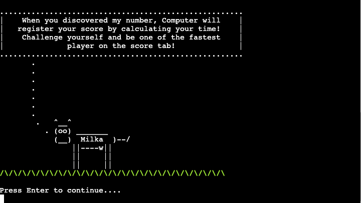
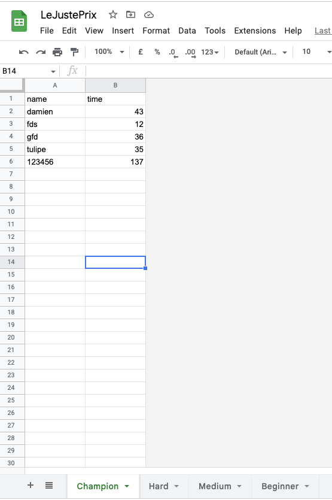
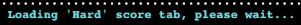
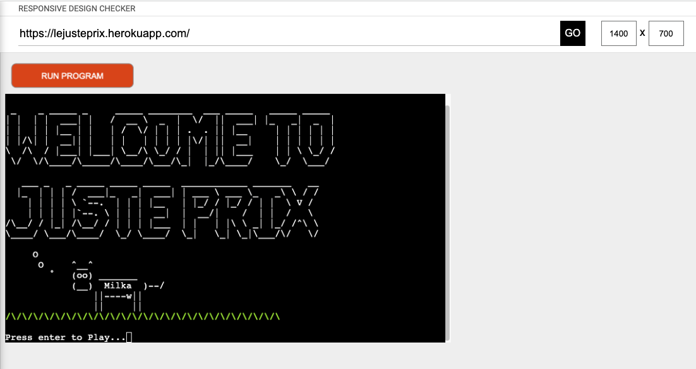
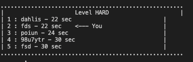
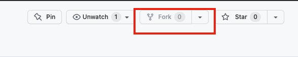
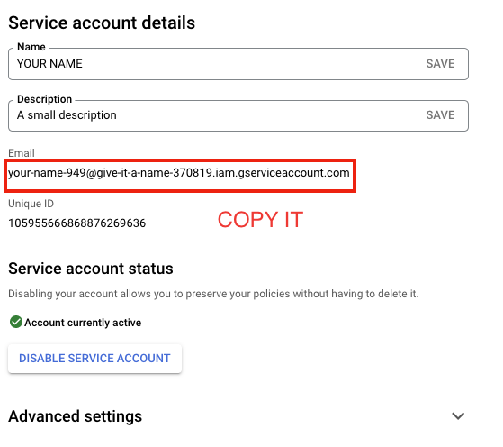
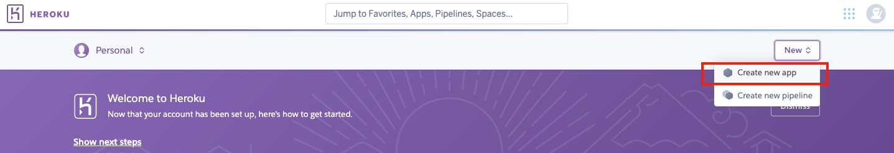

# Purpose of this project

This project was developed in order to demonstrate 
some ability to code in Python.
I got in mind that I had to get more experience with followings :
- Repetitions with loops
- Selections
- Using Modules 
- Aggregating data such as array and lists
- Iterations
- Functions
- Object-Oriented programming
- Data structures
- Exceptions and error management
- API keys

The main objective is to demonstrate competency in Python whilst proposing to code a simple game.

# Le Juste Prix

This game was very famous in 90' in France. I got inspired by doing a game as the original version of
"Le Juste Prix" except the fact that instead playing with prices, we plays with numbers.

If you are interested just check this link [here](https://www.youtube.com/watch?v=km34cI20HHw)

Sometimes is better a good picture than a big text to explain something : 

<b>Explain the game</b>

  

Some basics informations around this game :
- The user plays against the computer.
- The user select a level of difficulty which will give to computer a specific range where to select a number
- Timer is starting to run when computer inform the user that a number has been selected
- The user can try to guess the computer's number as many time as he wants but time is running
- The aim is to guess the computer's number as fast as possible!
- When the user enter the right computer's selected number, the Timer stops and computer calculates Time on-game
- Time is calculated in second as unit and Time on-game will determinate the player's position into the score tab
- A message is displayed to show up the player's position in the score tab

# Contents

* [**User Experience UX**](<#user-experience-ux>)
    * [Wireframes](<#wireframes>)
    * [Structure of the game](<#structure-of-the-game>)
    * [Programming Structure](<#programming-structure>)
    * [Python Logic](<#python-logic>)
    * [Data model](<#data-model>)
    * [Design Choices](<#design-choices>)
      -   [Typography](<#typography>)
      -   [Colour Scheme](<#colour-scheme>)
    * [User stories](<#user-stories>)
* [**Features**](<#features>)
    * [**Loading a New Game**](<#loading-a-new-game>)
    * [**When is the Game finished**](<#when-is-the-game-finished>)
    * [**Errors**](<#errors>)
    * [**Future Features**](<#future-features>)
* [**Technologies Used**](<#technologies-used>)
* [**Python Packages**](<#python-packages>)
* [**Testing**](<#testing>)
     * [**Am i responsive?**](<#am-i-responsive>)
     * [**Manual Testing**](<#manual-testing>)
     * [**Python/HTML/CSS Validator**](<#python>)
     * [**Browser Compatibility**](<#browser-compatibility>)
     * [**Bugs**](<#bugs>)
* [**Deployment**](<#deployment>)
* [**Credits**](<#credits>)
    * [**Content And Media**](<#content-and-media>)
    * [**Best part of this project**](<#best-part-of-this-project>)
*  [**Acknowledgements**](<#acknowledgements>)

# User Experience (UX)

## Wireframes

The wireframes for this game were inspired by  [CowSay](https://en.wikipedia.org/wiki/Cowsay).

If you are curious and want to try it on your own Unix Machine  Run `apt-get install cowsay` on a terminal as following :
(This action is not required, it's just for fun)

From beginning, i wanted to make the game interactive with a custom print function:

This is the final interaction layout of the Game:

[Back to top](<#contents>)

## Structure of the game

Le "juste prix" game has one main page called run.py . This [Page](https://lejusteprix.herokuapp.com/) is the default loading page. When first loading, a box pops up displaying a welcome message . Next box, the user will be invited to register an username.
The main page run.py is calling an other page called print.py for :
- printing out a welcome message : welcome_print()
- printing out messages to the user : my_print()
- printing out some coloring messages : red_string(text), green_string(text), blue_string(text)

I used this [site](https://patorjk.com/software/taag/#p=testall&c=lua&f=Graffiti&t=WELCOME%20TO%0AJUSTE%20PRIX%0A%0A) to build up this following ASCII design.

This name will be registered to Excel file database for scoring tab display (We will see this in details later on in
this readme file)

A Main menu has been created to give easy access to differents sections :
- Play Game
- See the instructions of the Game
- See the top5 players score for each Level of difficulty

Going through Instructions :

Press Enter to run the instructions....

We introduce an example of one Game so the user get to known more about what is happening
when game starts :

After finishing to read the instructions, the user can start playing!

 The Game have 4 differents level of difficulty:
* Beginner : User will have to guess a number from 1 to 100
* Medium : User will have to guess a number from 1 to 500
* hard : User will have to guess a number from 1 to 1000
* Champion : User will have to guess a number from 1 to 10000

After selecting the level of difficulty, the game starts :

Each time the user type a number, a timeline is displayed with a message :

When user found out the right number, computer stops the time and calculate the time on-game, a message is displayed :

A score tab is displayed with the user's position :

[Back to top](<#contents>)

## Programming Structure

Before starting to code, I wanted to have a big picture of the programming structure :

 **Beginning of the Game** :
   - 1/ Give instructions of the game 
   - 2/ Choose the level of the game 
   - 3/ Timer start to run 
   - 4/ Run the Game 
   - 5/ User found the good number, we stop the Timer 
   - 6/ Calculate the time on-game 
   - 7/ According the selected level, we select the right worksheet 
   - 8/ We register the data into excel file 
   - 9/ We sort the files by Time value, smaller time is first 
   - 10/ We shows the scoring tab 

[Back to top](<#contents>)

## Python Logic

I created a graphcet-like diagram to get a big picture of all the functions needed for the Game :

"Fin" (Black circle) means "End" Point on this graph.
I wanted to change it through the [Lucid Graph Website](https://lucid.app/lucidchart) but then I was limited by the free version, could not modificate anything more on the graph without suscribing for a premium access.

[Back to top](<#contents>)

## Data Model

I used [Google Sheets](https://www.google.co.uk/sheets/about/) to store all the data of the game. 
The Google Sheet have 4 separated worksheets :

* *Beginner* - Used to store users username and time performance in Beginner Level
* *Medium* - Used to store users username and time performance in Medium Level
* *Hard* - Used to store users username and time performance in Hard Level
* *Champion* - Used to store users username and time performance in Champion Level

[Back to top](<#contents>)

## Design Choices

 * ### Typography

      The game beeing only running with a terminal design, i wanted to create a custom print function to make it more friendly. In fact, no graphical effects here so the main focus was on creating
      a friendly design to catch the interest from the user...

[Back to top](<#contents>)

 * ### Colour Scheme
      I used 3 differents coloring effects :

  - Blue : when computer interact with the user

  - Green : When an action have succeed

- Red : When an action failed

[Back to top](<#contents>)

### User stories

First Time Visitor Goals

- As a First Time Visitor, I want immediately to understand the main purpose of the game.
- I want to be able to quickly understand the game controls and mechanics in order to enjoy playing the game
- I want to be able to consult the game instructions as many time I want.
- I want to be able to see my score after each game.
- I would like to play a simple game, with a fairly short play time.

Considering that there is no possibility to login for the user, the Game is built in the way that :
  - As long as you perform at least one game, your name and scoring is registered into database
  - if your name is already on the database, your score for each game will be updated (only if user perform a new personal record of course!)
  - The user can come back to play this game any time in the future and challenge himself using the same username as registered previously

# Features 

The game should have a fun design and is intended for users as an entertainment value only.

[Back to top](<#contents>)

## Loading a New Game

  ### How do we start a new Game?
To start a new Game :
- Give your username
- Choose option 1 in the main menu
- Select your level of difficulty
- Game is starting

[Back to top](<#contents>)

 ## When is the game finished

  ### How do we stop the Game ?

If you want to stop playing do the following :

- Press `"q"` when prompt the following message :

OR
Click the following button : 

- Then close the brownser window

- To get back to the game

[Click here](https://lejusteprix.herokuapp.com/)

Easy, right? :-D

[Back to top](<#contents>)

* ## Errors

  ### A message is displayed
Each time user type an incorrect input, Game will guide to get back on tracks :

[Back to top](<#contents>)

  ### Future Features

As a Future Features, it could be interesting for the user to choose himself the range of number to guess...

[Back to top](<#contents>)

# Technologies Used

* [Heroku](https://www.heroku.com/) - used to deploy the Game online.
* [Gitpod](https://www.gitpod.io/#get-started) - used to get a workspace to use for coding.
* [Github](https://github.com/) - used to edit the website.
* [veed](https://www.veed.io/) - used to edit Gif for readme file.
* [Favicon](https://favicon.io/) - used to create a favicon for the website.
* [Lucid App](https://lucid.app/) - used to create The logic flow on the application with Graphcet style diagram.
* [Python](https://en.wikipedia.org/wiki/Python_(programming_language)) - Provides game's functions and rules.
* [GitBash](https://en.wikipedia.org/wiki/Bash_(Unix_shell)) - Terminal used to push changes to the GitHub repository.
* [Google Chrome DevTools](https://developer.chrome.com/docs/devtools/) - Used to test responsiveness and debug.
* [Responsive Design Checker](https://www.responsivedesignchecker.com/) - Used to test responsiveness.
* [Microsoft Excel](https://www.microsoft.com/en-us/microsoft-365/excel) - Used to create spreadsheets to easily view data.
* [Google Sheets](https://www.google.co.uk/sheets/about/) - Used to host the application data.
* [VS STUDIO](https://code.visualstudio.com/) was used to edit the code.
* [Excalidraw](https://excalidraw.com/) to draw the image to describe the game in. first part of this document.
* [Readme.so](https://readme.so/) was used to write this readme File.

[Back to top](<#contents>)

# Python Packages

* [GSpread](https://pypi.org/project/gspread/) - Used to transfer data between google sheets.
* [Randint](https://docs.python.org/3/library/random.html) - Used to implement pseudo-random number generators.
* [OS](https://docs.python.org/3/library/os.html) - Used to provide a way of using operating system dependent functionality. Clear the screen output for example.
* [Time](https://docs.python.org/3/library/time.html) - Used to provide various time-related functions.
* [Wrap](https://docs.python.org/3/library/textwrap.html?highlight=wrap#module-textwrap) - Used for editing strings structure.

[Back to top](<#contents>)

# Testing

## Am I responsive App?

- Responsive test from [Responsive designchecker](https://www.responsivedesignchecker.com/) :

* ## Responsiveness Testing
    * Although this project is not required to be fully responsive, I still conducted responsive tests manually with [Google Chrome DevTools](https://developer.chrome.com/docs/devtools/) and [Responsive Design Checker](https://www.responsivedesignchecker.com/).

    

[Back to top](<#contents>)

 * ## Manual Testing
    * In addition to the other tests, I have conducted a manual check list for myself to carry out to make sure that everything is working as intended.

   * ### Manual Tests Conducted
      * **Startup Display**
        * Verify that the input for username refuses some specific caracter as '\n', '\\' or '"'.
        * Verify that the username validation is working as intended.
        * Verify that if the user enters a correct name, they will move to the Main Menu.
      * **Main Menu**
        * Verify that the users name is displayed at the top of the page.
        * Verify that the user receives an invalid input message if an incorrect key has been entered.
        * Verify that all menu options load as intended only if the user enters the appropriate key.
      * **Level of difficulty Menu**
        * Verify that the user receives an invalid input message if an incorrect key has been entered.
      * **On Game inputs**
        * Verify that the user receives an invalid input message if an incorrect key has been entered.
        * Verify that the Timeline is correctly displayed.
        * Verify that the message from computer is clear enough to guide user finding the right number.

      * **Score Tab**
        * Verify that an registered user always appears on the tab score even not in top5 players.

        

        * Verify that the score tab is displayed correctly
        * Verify that the sort_tab() function is working correctly and sort the all cells of the selected worksheet by time.
        * Verify that the Application is creating missing worksheet needed to register the player's score

        

        

        * Verify that the Application is creating missing worksheet when displaying the top5 players from the main menu

        

      * **Rules of the Game**
        * Verify that the rules of the game are accessible from first visit users.
        * Verifiy that the rules are easy to understand and well presented
        * Verify that the rules are explained with a clear example
      * **Exit App**
        * Verify that when the user exits the app, a message is displayed with a thank you message and then the program shuts down successfully.

## PYTHON VALIDATOR

### PYTHON

The Python validator results is below:
- run.py, print.py : for testing I used the following tools [here](https://pep8ci.herokuapp.com/) 

First try, I got hundreds of warnings :

However these have now been all fixed because it was only about extra space or too long syntax issues.

No errors detected for both files.

[Back to top](<#contents>)

### HTML CHECKER

The HTML validator results is below:

No errors detected.

### CSS CHECKER

The  [CSS Validator](https://jigsaw.w3.org/css-validator/) results is below:
  
No errors detected.

[Back to top](<#contents>)

## Browser Compatibility

The website was tested on the following browsers with no visible issues for the user :
- Brave
- Mozilla Firefox
- Safari

Appearance, functionality and responsiveness were consistent throughout for the previous range of browsers.

[Back to top](<#contents>)

* ## Lighthouse Testing 

    * Furthermore the website has been through the [Chrome Dev Tools](https://developer.chrome.com/docs/devtools/) Lighthouse Testing which tests the website for the following:
        * Performance - How the page performs whilst loading.
        * Accessibility - Is the site accessible for all players and how can it be improved.
        * Best Practices - Site conforms to industry best practices.
        * SEO - Search Engine Optimisation. Is the site optimised for search engine result rankings.

[Back to top](<#contents>)

### To sum up
To sum up :

- I confirm that the main content of the game is readable and easy to understand.
- I confirm that the interaction with the user is smooth and efficient with errors management functions.

[Back to top](<#contents>) 

### Bugs

## Fixed Bug

As i said in the first part of this document, I wanted to create an custom print function for this game. It tooks me some good time to code it properly because each message to display can be different to an other (structure, coloring, scoring tab etc...)
Dealing with different type of messages as coloring or score tab can create some problems in the display :

Detecting each type of messages to display, I found the way to have a perfect display :

Also the black and white screen was hard to display error messages as "Wrong number" or "Try again" or simply get the user's focus front of a big block of text as below :

Big blocks of text looks better like this :

So, I had to find the way to incoporate into the custom print function some coloring doing as the following :

Then i could add some coloring text depending the situation :

When I first deployed on Heroku, I could finally see the layout of the game and
i could see that the fixed window space create some distortion on the display. In fact, the amount of text on each screens of the game can be different, the layout can appear far away from the bottom zone and 
create some problem of visibility :

For that, I added some new lines into my custom print function :

First, I needed to clear the screen on each new call of my custom print function :

After that, I calculated the number of lines to print out and knowing the maximum's number of lines (80 characters wide and 24 rows high) of this fixed windows, it was easy to build up a `for loop` to generate the right quantity of lines to end up always on the bottom of the screen.

[Back to top](<#contents>) 

## Unfixed Bug

When making some repetitive tests on my code, i got this following message :

It looks like the only way to fix this problem of quota is to register for a new package from Google Cloud Service.

[Back to top](<#contents>)

# Deployment

## How to fork a repository :

If you need to "FORK" a repository:

1. Login in to [GitHub](https://github.com/) and go to https://github.com/artontray/PROJECT3
2. In the top right corner, click `Fork`
3. The next page will be the forked version of https://github.com/artontray/PROJECT3 but in your own repository

[Back to top](<#contents>)

### How to create a local clone of this project :

The method from cloning a project from GitHub is below:

1. Under the repository’s name, click on the **code** tab.
2. In the **Clone with HTTPS** section, click on the clipboard icon to copy the given URL.

3. In your IDE of choice, open **Git Bash**.
4. Change the current working directory to the location where you want the cloned directory to be made.
5. Type **git clone**, and then paste the URL copied from GitHub.
6. Press **enter** and the local clone will be created.

[Back to top](<#contents>)

### To deploy the project with Heroku:

The site was deployed to Heroku cloud Platform. To be able to run your python program on the web,
 you need Heroku Cloud platform to host it and deploy. There are severals steps to proceed,
 please , follow carefully every steps :
  1. Create an account gmail
  2. Go to [Cloud](https://console.cloud.google.com/)
  3. Create a New Project

  
    
  
  
  4. Select your project

  

  5. Search for Library into APIs and Services Left Menu

  

[Back to top](<#contents>)

  6. Search for Google Drive API and ENABLE IT

  
  
  

  7. Do the same but searching for google Sheet and ENABLE IT

  

  8. Create CREDENTIALS

  
  
  
  

  9. Select a role

  
  

[Back to top](<#contents>)

  10. Editing Credentials

  
  
  
  

  11. Download your JSON FILE

  It will automatically download a JSON file, save it on your computer.

  

  11. Key will be active

  

[Back to top](<#contents>)

  12. Import the excel file

  Go to this [File](https://docs.google.com/spreadsheets/d/1qtw3ptZlbgvp-eiT1_8UuVNh6PpEY68l-ZJn4-vVrac/edit#gid=0)

  And Make a copy and share the file with the email created into cloud 

  
  
  
  

  Be sure to select EDITOR when sharing the file :

  

  13. Fork the project with Github and open it with Gitpod :

  To fork the project, refer to this part [**Deployment**](<#deployment>)

  Launch Gitpod and drag and drop the JSON file into the project and rename it as following :
  
  Clik here : [GitPod](https://gitpod.io/workspaces)

  

[Back to top](<#contents>)

  14. Protect your JSON FILE :

  Add the creds.json file into .gitignore file

  

  Just after that, run : 
  - git add .
  - git commit -m "Initial commit"
  - git push

  15. Install gspread

  run on the terminal : pip3 install gspread google-auth

[Back to top](<#contents>)

  16. Finally Deploy with Heroku :

  Go [Heroku Plateform](https://dashboard.heroku.com/)

  Create a New App 

  

  Add Buildpack : Python and nodejs

  

  Configure VARS : 

  
  
  
  Connect your github account and Deploy : 

  
  
  
  

[Back to top](<#contents>)

  Wait for installation and check your deployed project : 

  
  

[Back to top](<#contents>)

# Credits
### Content and Media

* The general custom print function idea came from [Cow Say](https://en.wikipedia.org/wiki/Cowsay)
* The favicon came from [This site](https://stock.adobe.com/fr/search?k=%22juste+prix%22)
* The first Welcome Menu ASCII design came from [Patorjk.com](https://patorjk.com/software/taag/#p=testall&c=lua&f=Graffiti&t=WELCOME%20TO%0AJUSTE%20PRIX%0A%0A)
* General mathematics functions information in Python  came from [This site](https://docs.python.org/3/library/math.html)
* General Os functions information in Python  came from [This site](https://docs.python.org/3/library/os.html)
* General path functions information in Python  came from [This site](https://docs.python.org/3/library/os.path.html)
* General random functions information in Python  came from [This site](https://docs.python.org/3/library/random.html)
* General information about exceptions in Python  came from [This site](https://docs.python.org/3/library/exceptions.html)

## Best part of this project

To be honest, best parts of my learning progress are the following :
- Learning Python
- Learning how to connect an excel File with programming code through API
- Learning how to deal with exceptions and errors messages
- Learning how to import external library and incoporate it to my coding
- Learning Oriented Object programming
- This function is my favorite one : Asking for an username through an input, creating an Object called User and Launching a Menu of option in one line of code!

[Back to top](<#contents>)

# Personal Development

That was my first time with python. I instantly enjoyed it so much starting to code with this language. I feel like I understand the fundamentals of Python even I understand that I have only scratched the surface but I understand why it is currently one of the most popular programming language in the world. It's easy readeable and mostly so powerful! I can' t wait to experiment Python in other application as a dynamic database website.

[Back to top](<#contents>)

# Acknowledgements
The site was completed as a Portfolio 3 Project for the Full Stack Software Developer Diploma at the [Code Institute](https://codeinstitute.net/).
As such I would like to thank the web in general for beeing such an open library for learning, the Slack community for the good vibes and my mentor **Precious_Mentor** for the support.

This material has been prepared for educational purposes only.

Damien B.

[Back to top](<#contents>)