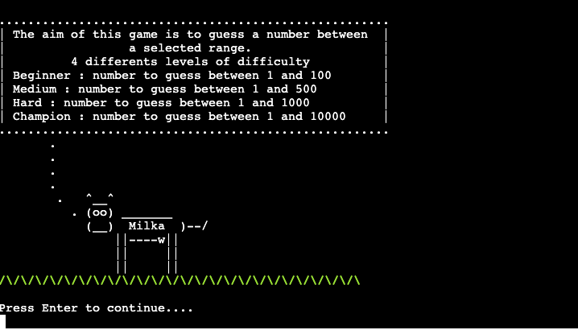
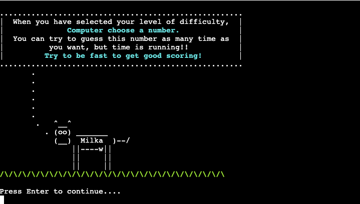

# Purpose of this project

This project was developed in order to demonstrate 
some ability to code in Python.

# Le Juste Prix

This game was very famous in 90' in France. I got inspired by doing a game as the original version of
"Le Juste Prix"

If you are interested just check this link [Just check this link!](https://www.youtube.com/watch?v=km34cI20HHw)

# Contents

* [**User Experience UX**](<#user-experience-ux>)
    * [Wireframes](<#wireframes>)
    * [Structure of the game](<#structure-of-the-game>)
    * [Programming Structure](<#programming-structure>)
    * [Design Choices](<#design-choices>)
    *   [Typography](<#typography>)
    *   [Color Scheme](<#colour-scheme>)
    *   [User stories](<#user-stories>)
* [**Features**](<#features>)
    * [**Header**](<#header>)
    * [**Body**](<#body>)
    * [**Footer**](<#footer>)
    * [**Displaying Cards**](<#displaying-cards>)
    * [**Loading a New Game**](<#loading-a-new-game>)
    * [**When is the Game finished**](<#when-is-the-game-finished>)
    * [**Error 404**](<#error-404>)
    * [**Future Features**](<#future-features>)
* [**Technologies Used**](<#technologies-used>)
* [**Testing**](<#testing>)
     * Am i responsive?
     * HTML / CSS Validator
     * Browser Compatibility
     * Lighthouse
     * Bugs
* [**Deployment**](<#deployment>)
* [**Credits**](<#credits>)
    * [**Content**](<#content>)
    * [**Media**](<#media>)
    * [**Best part of this project**](<#best-part-of-this-project>)
*  [**Acknowledgements**](<#acknowledgements>)

# User Experience (UX)

## Wireframes

The wireframes for this website were inspired by  [CowSay](https://en.wikipedia.org/wiki/Cowsay).
From beginning, i wanted to make the game interactive with a custom print function:

This is the final interaction layout of the Game:

[Back to top](<#contents>)

## Structure of the game

Le juste prix game has ONE main page run.py . The [Game](https://lejusteprix.herokuapp.com/) is the default loading page. When first loading, a box pops up asking for a name.

This name will be registered to Excel file database for scoring tab display.

An other Box is displayed to allows the user to get to know about the objectives and rules of the Game :

Press any key to run the instructions....

After finishing to read the instructions, the user can start playing!

 The Game display is easy, 4 differents level of difficulty:
* Beginner : User will have to guess a number from 1 to 100
* Medium : User will have to guess a number from 1 to 500
* hard : User will have to guess a number from 1 to 1000
* Champion : User will have to guess a number from 1 to 10000

[Back to top](<#contents>)

## Programming Structure

Before starting to code, I wanted to have a big picture of the programming structure :

 ** Beginning of the Game ** :
   - 1/Get instructions of the game 
   - 2/choose the level of the game 
   - 3/Time is starting to get registered 
   - 4/Run the Game 
   - 5/user found the good number, we stop the Time 
   - 6/Calculate the time on-game 
   - 7/According the selected level, we select a right worksheet 
   - 8/We register the data into excel file 
   - 9/We sort the files by Time value, smaller time is first 
   - 10/We show the scoring tab 

[Back to top](<#contents>)

