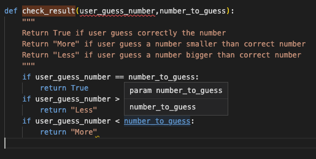

# Purpose of this project

This project was developed in order to demonstrate 
some ability to code in Python.

# Le Juste Prix

This game was very famous in 90' in France. I got inspired by doing a game as the original version of
"Le Juste Prix"

If you are interested just check this link [here](https://www.youtube.com/watch?v=km34cI20HHw)

Sometimes is better a good picture than a big text to explain something : 

# Contents

* [**User Experience UX**](<#user-experience-ux>)
    * [Wireframes](<#wireframes>)
    * [Structure of the game](<#structure-of-the-game>)
    * [Programming Structure](<#programming-structure>)
    * [Design Choices](<#design-choices>)
    *   [Typography](<#typography>)
    *   [User stories](<#user-stories>)
* [**Features**](<#features>)
    * [**Loading a New Game**](<#loading-a-new-game>)
    * [**When is the Game finished**](<#when-is-the-game-finished>)
    * [**Errors**](<#errors>)
    * [**Future Features**](<#future-features>)
* [**Technologies Used**](<#technologies-used>)
* [**Testing**](<#testing>)
     * Am i responsive?
     * Python Validator
     * Browser Compatibility
     * Lighthouse
     * Bugs
* [**Deployment**](<#deployment>)
* [**Credits**](<#credits>)
    * [**Content**](<#content>)
    * [**Media**](<#media>)
    * [**Best part of this project**](<#best-part-of-this-project>)
*  [**Acknowledgements**](<#acknowledgements>)

# User Experience (UX)

## Wireframes

The wireframes for this website were inspired by  [CowSay](https://en.wikipedia.org/wiki/Cowsay).
From beginning, i wanted to make the game interactive with a custom print function:

This is the final interaction layout of the Game:

[Back to top](<#contents>)

## Structure of the game

Le juste prix game has ONE main page run.py . The [Game](https://lejusteprix.herokuapp.com/) is the default loading page. When first loading, a box pops up asking for a name.

This name will be registered to Excel file database for scoring tab display.

An other Box is displayed to allows the user to get to know about the objectives and rules of the Game :

Press any key to run the instructions....

After finishing to read the instructions, the user can start playing!

 The Game display is easy, 4 differents level of difficulty:
* Beginner : User will have to guess a number from 1 to 100
* Medium : User will have to guess a number from 1 to 500
* hard : User will have to guess a number from 1 to 1000
* Champion : User will have to guess a number from 1 to 10000

[Back to top](<#contents>)

## Programming Structure

Before starting to code, I wanted to have a big picture of the programming structure :

 ** Beginning of the Game ** :
   - 1/Get instructions of the game 
   - 2/choose the level of the game 
   - 3/Time is starting to get registered 
   - 4/Run the Game 
   - 5/user found the good number, we stop the Time 
   - 6/Calculate the time on-game 
   - 7/According the selected level, we select a right worksheet 
   - 8/We register the data into excel file 
   - 9/We sort the files by Time value, smaller time is first 
   - 10/We show the scoring tab 

[Back to top](<#contents>)

## Design Choices

 * ### Typography
      The game beeing only running with a terminal design, i wanted to create a custom print function 
      to make it more friendly. In fact, no graphical effects here so the main focus was on creating
      a friendly design to get an interest on playing...

      

[Back to top](<#contents>)

* ### User stories

First Time Visitor Goals

- As a First Time Visitor, I want immediately to understand the main purpose of the game.
- I want to be able to quickly understand the game controls and mechanics in order to enjoy playing the game
- I want to be able to consult the game instructions as many time I want.
- I want to be able to see my score as I play the game.
- I would like to play a simple game, with a fairly short play time.

Considering that there is no possibility to login for the user, all users are considered as "first time visitor".
But the Game is built in the way that if you use the same username, you can try to challenge yourself
getting a better scoring on each game.

# Features 

The game should have a fun design and is intended for users as an entertainment value only.

[Back to top](<#contents>)

* ## Loading a New Game

  ### How do we start a new Game?
There is nothing to do, just start the game and give your username.

After the Result of the game has been revealed, a new game is loading only if user wants it :

[Back to top](<#contents>)

* ## When is the game finished

  ### How do we stop the Game ?

It's a no ending Game, one new Game will be generated after revealing the result of current game.
The score will be registered into the excel file and a new game is loading.
So if you want to stop playing do the following :

- Press n when prompt the following message :

- Then close the brownser window

- To get back to the game

[Click here](https://lejusteprix.herokuapp.com/)

Easy, right? :-D

[Back to top](<#contents>)

* ## Errors

  ### A message is displayed
Each time you type an wrong answer, we will guide you to get back to reality :

[Back to top](<#contents>)

  ### Future Features
As a Future Features, I would like to developp a robot to be able to challenge real challengers.
Having the check_result function returning True, More or Less, it can be easy to build a robot
trying the right number until the answer returns True.

Also, it could be interesting for the user to choose himself the range of number to guess...

[Back to top](<#contents>)

# Technologies Used

* [Python](https://www.python.org/) - provides game's functions and rules.
* [Gitpod](https://www.gitpod.io/#get-started) - used to deploy the website.
* [Github](https://github.com/) - used to host and edit the website.

[Back to top](<#contents>)

# Testing

## Am I responsive Website?
Yes, I am!
- The responsive design tests were carried out on Iphones, Samsung Galaxy S8+, Ipad Air,Surface Pro 7 and even Nest Hub Max. The final design is much better on normal screen as home display.

- Responsive test from https://ui.dev/amiresponsive :

[Back to top](<#contents>)

## PYTHON VALIDATOR

### PYTHON

The Python validator results is below:
- run.py : for testing I used the following tools [here](https://pep8ci.herokuapp.com/) 

[Back to top](<#contents>)
